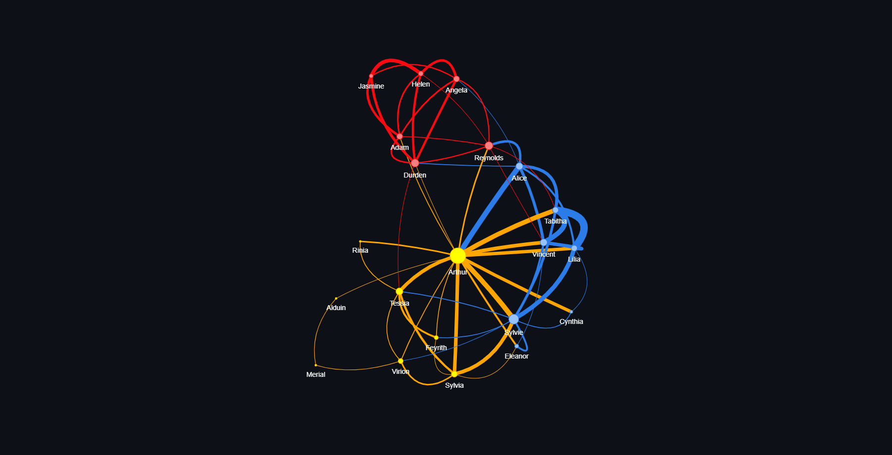
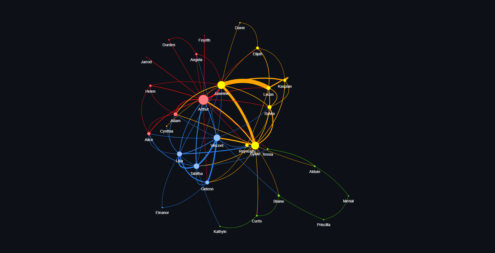
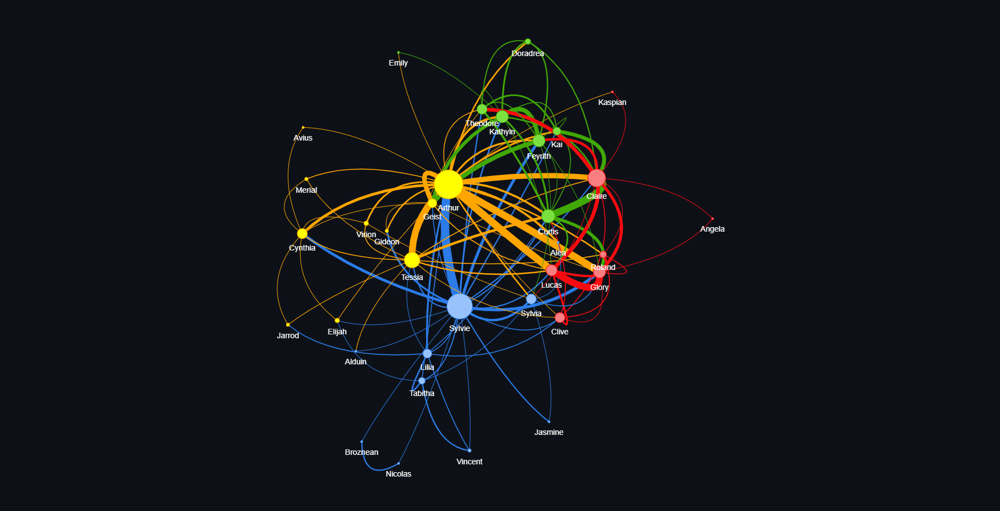
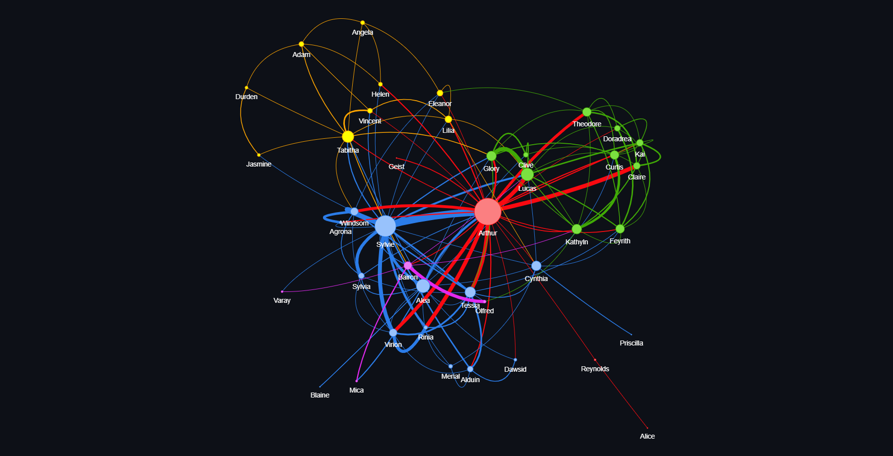

# TBATE - Relationships

### Data analysis with python from the light novel The Beginning after the End.

Analyze relationships between characters in the light novel The Beginning after the End using natural language processing with spacy, and visualizing relationships with pyvis, networkx and community.

## Results

*Click on the title to access the interactive network*

[Volume 1](https://ferndwehbe.github.io/tbate-relationships/Networks/Volume1.html)

[Volume 2](https://ferndwehbe.github.io/tbate-relationships/Networks/Volume2.html)

[Volume 3](https://ferndwehbe.github.io/tbate-relationships/Networks/Volume3.html)

[Volume 4](https://ferndwehbe.github.io/tbate-relationships/Networks/Volume4.html)

[Volume 5](https://ferndwehbe.github.io/tbate-relationships/Networks/Volume5.html)

[Volume 6](https://ferndwehbe.github.io/tbate-relationships/Networks/Volume6.html)

[Volume 7](https://ferndwehbe.github.io/tbate-relationships/Networks/Volume7.html)

[Volume 8](https://ferndwehbe.github.io/tbate-relationships/Networks/Volume8.html)

[Volume 9](https://ferndwehbe.github.io/tbate-relationships/Networks/Volume9.html)

[All Volumes Together](https://ferndwehbe.github.io/tbate-relationships/Networks/AllNovel.html)

*The size of node represent how much connections.*

*The width of links represent how much iteration these persons have.*

*The color represent a **local community**.*

# Credits

This project is based on *Network of The Witcher* create by [Thu Vu data analytics](https://www.youtube.com/c/Thuvu5)

Link of the Video: https://www.youtube.com/watch?v=fAHkJ_Dhr50
